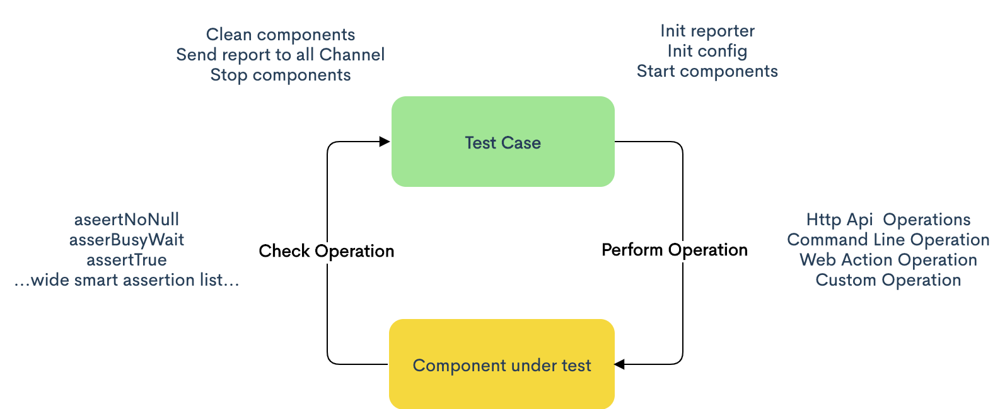
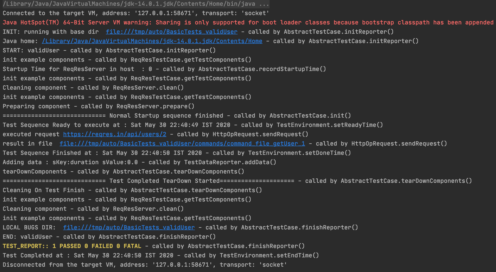
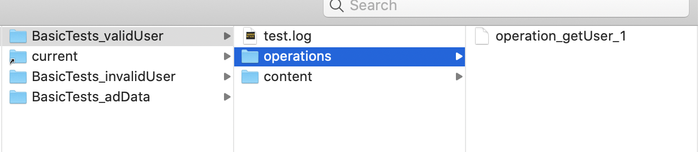
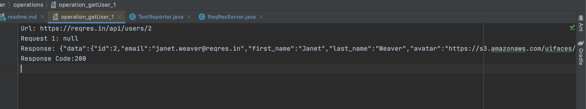
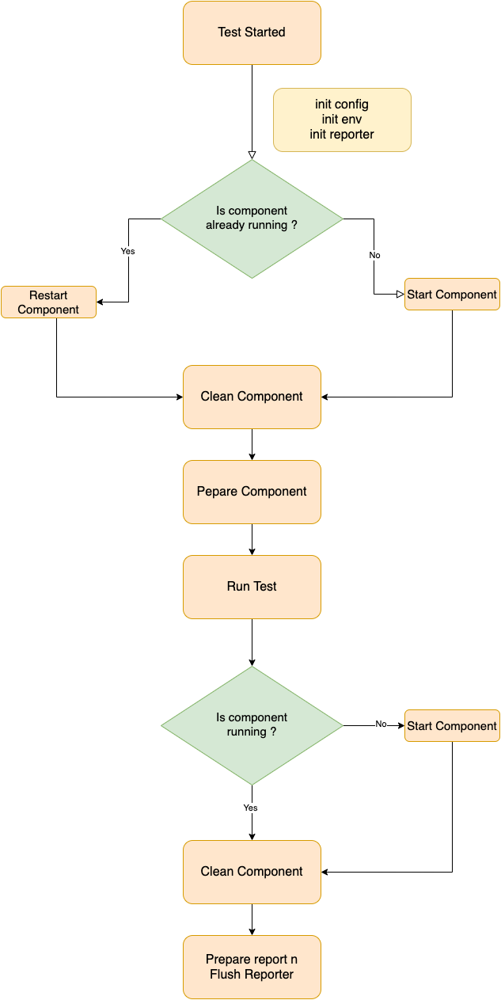
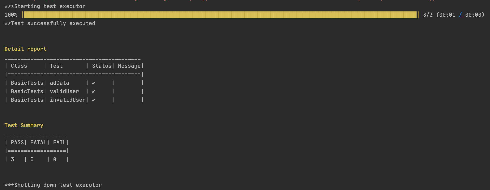
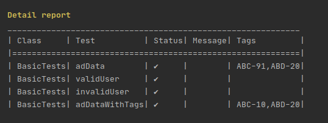

<div>
  <h1 style="display: inline"> Auto an Enhanced Automation Tool (eat) </h1>
  
</div>

[](https://github.com/Priytam/auto/blob/master/LICENSE)
[](https://circleci.com/gh/Priytam/auto)
[](https://travis-ci.org/Priytam/auto)
[](https://search.maven.org/search?q=g:com.github.priytam%20AND%20a:framework)

[](http://hits.dwyl.io/Priytam/auto)
[](http://makeapullrequest.com)
[](https://github.com/ellerbrock/open-source-badges/)
[](https://GitHub.com/Naereen/StrapDown.js/graphs/commit-activity)

## Contributors ✨

Thanks goes to these wonderful and brilliant people:

<!-- ALL-CONTRIBUTORS-LIST:START - Do not remove or modify this section -->
<!-- prettier-ignore-start -->
<!-- markdownlint-disable -->
<table>
    <tr>
        <td align="center">
            <a href="https://github.com/Priytam">
                
                <br/>
                <sub><b>Priytam Jee Pandey </b></sub>
            </a>
            <br/>
            <a href="https://github.com/Priytam/auto/commits?author=priytam" title="Documentation">📖</a>
            <a href="https://github.com/Priytam/auto/pulls?q=is%3Apr+reviewed-by%3Apriytam" title="Reviewed Pull Requests">👀</a>
            <a href="#design-priytam" title="Design">🎨</a>
            <a href="#talk-priytam" title="Talks">📢</a>
            <a href="#question-priytam" title="Answering Questions">💬</a>
        </td>
        <td align="center">
            <a href="https://github.com/vipulpopli7534">
                
                <br/>
                <sub><b>Vipul Popli</b></sub>
            </a>
            <br/>
            <a href="https://github.com/Priytam/auto/commits?author=vipulpopli7534" title="Documentation">📖</a>
            <a href="https://github.com/Priytam/auto/pulls?q=is%3Apr+reviewed-by%3Avipulpopli7534" title="Reviewed Pull Requests">👀
            </a>
            <a href="#question-vipulpopli7534" title="Answering Questions">💬</a>
            <a href="#tool-vipulpopli7534" title="Tools">🔧</a>
        </td>
        <td align="center">
            <a href="https://github.com/Niyatiluthra">
                
                <br/>
                <sub><b>Niyati Luthra</b></sub>
            </a>
            <br/>
            <a href="https://github.com/Priytam/auto/commits?author=Niyatiluthra" title="Documentation">📖</a>
            <a href="https://github.com/Priytam/auto/pulls?q=is%3Apr+reviewed-by%3ANiyatiluthra" title="Reviewed Pull Requests">👀</a>
            <a href="#question-Niyatiluthra" title="Answering Questions">💬</a>
            <a href="#tool-Niyatiluthra" title="Tools">🔧</a>
        </td>
    </tr>
</table>


## Purpose
*To write automated tests for api, web page and command line based application*

Below points may interests you using this tool

* Embedded mock server
* Easy to write tests
* Zero test case maintainability
* Clean teardown
* Clean test case life cycle
* Advance/enhanced assertion api
* Advance/enhanced rules
* Clean test log and Keep logs of every action performed on server 
* Highly configurable reporting
* Easy build process and ready to run regression
* Capable of stopping, starting and cleaning components at every test run
* Abstraction of http api, command line and web action operation to write tests faster
* Usable utils (Json, Xml, File etc.)

### Need support using this tool in your org
Don't hesitate to write me a mail at `(mrpjpandey@gmail.com with the topic need help)`, and I will help you for free.

## See it in action in a Sample App
While this guide explains the *what*, *why* and *how*, I find it helpful to see them in practice. 
This tool is accompanied by a sample application that follows basic usage.You can find the [sample application here](https://github.com/Priytam/auto/tree/master/exampleApp) 
in the `exampleAPp` folder. Feel free to grab it, clone it, or fork it.
[Instructions on running it are in its readme](https://github.com/Priytam/auto/blob/master/exampleApp/readme.md).

## Contribution is always welcome
Create pull request against any bug or feature (raise one if doesn't exit). 
After reviewing it I will merge your PR and add your name in contributors list. 
P.S. your PR should also contain explanation of changes below

## Table of Contents

  1. [Design](#design)
  1. [Getting Started](#getting-started)
  1. [Component](#component)
  1. [Test Case](#test-case)
  1. [Operations](#operations)
        * [Custom Operation](#custom-operation)
        * [Api Operations](#api-operations)
        * [Commandline Operations](#commandline-operations)
        * [WebUi Operations](#webui-operations)
        * [Method call as operations](#use-method-call-as-operations)
  1. [Life Cycle](#life-cycle)
  1. [Checks](#checks)
  1. [Configuration](#configuration)
  1. [Reporting and Test Execution](#reporting-and-test-execution)
  1. [Build and Deployment](#build-and-deployment)
  1. [Mock Server](#mock-server)
  1. [Annotations and custom rules](#annotations-and-custom-rules)
        * [@Tags](#tags)
        * [@KeepLog](#@keeplog)
        * [@HaltOnError](#haltonerror)
        * [@ParameterizedTest](#parameterizedtest)
        * [@Repeat](#repeat)
  1. [Example test cases](#example-test-cases)
  1. [Best Practices](#best-practices)

## Design



Testing is divided into three verticals

* Components to be tests
* Operations to be performed on components
* Test Case which does above job and Assert its correctness

Components can be any application which uses any or all of Http api, Web Ui or Command Line 
to interact.

Operation is the request we made to component to perform some action. 

Test Case contain sets of Operation performed on component and one or more Assertion to check Its validity.

Above design decouple tests from operation and components and helps in zero test maintainability,
Lets say component was written in Node.js and now org decided to move it to java spring boot and hence its start stop
operation is different now what we need to change is stopOp and startOp of component and all hundreds and thousands of 
tests will remain intact and will continue to run like charm.

Suppose a travel product UI automated using this tool which have operation flight search and now UI template changed to material design
all automated tests written will keep on running after changing searchOp.   

One can say yes I can achieve this without any framework! My answer is yes you can. This framework helps you to achieve 
this in easy and clean way with high level of abstraction and advance apis. This framework follows best practices.
 
Auto has Generic Command Line, Http and Web action (using selenium) Op. It keeps the track of all operation performed in tests
helps in debugging. It has embedded mock server to mock third party api for tests stability.   

**[Back to top](#table-of-contents)**

## Getting Started

It is easy to start using this tool, To use this you need to have java 8 or above installed in your system. (tested with java 9, 11, 14)

Let me explain the same using some example. We will write test to automate https://reqres.in/ which have operations to
 * List users (https://reqres.in/api/users?page=2), 
 * Single User (https://reqres.in/api/users/2), 
 * Single User not found (https://reqres.in/api/users/23).


Create a gradle/maven project and include auto framework as dependency
```groovy
dependencies {
    compile 'com.github.priytam:framework:1.0'
}
```

```xml
<dependency>
  <groupId>com.github.priytam</groupId>
  <artifactId>framework</artifactId>
  <version>1.0</version>
</dependency>
```
Here we have one component to test (reqres) by performing above three operations. Since we can't start stop this component.

> So First we will be creating 
> * one component, 
> * a test case 
> * an operation (above steps are one time effort) 
 
> And then we can start writing tests

Component will be AlwaysRunningComponent
```java
    public class ReqResServer extends AbstractAlwaysRunningTestComponent {
    
        protected ReqResServer(TestComponentData dData) {
            super(dData);
        }
    
        @Override
        public void clean(boolean bForce) {
            // will be called during component tear down
        }
    
        @Override
        public void prepare() {
            // prepare component 
        }
    }
```

Creating our Test case
```java
    public class ReqResTestCase extends AbstractTestCase {
    
        private ReqResServer server;
    
        protected ReqResTestCase() {
            super("ReqRes");
        }
    
        @Override
        protected void initComponents() {
            TestComponentData testComponentData = new TestComponentData.Builder()
                    .build(getCurrentApplicationConfig().getServer());
            server = new ReqResServer(testComponentData);
        }
    
        @Override
        public List<? extends ITestComponent> getTestComponents() {
            TestReporter.TRACE("init example components");
            List<ITestComponent> lstComponents = new ArrayList<>();
            lstComponents.add(server);
            return lstComponents;
        }
        
        public ReqResServer getServer() {
            return server;
        }
    }
```

Creating GetUser Operation
```java
public class GetUserOp  extends AbstractHttpOperation {

    private final String baseUrl;
    private final int userId;
    private final static String USER_ENDPOINT = "/api/users/";

    public GetUserOp(String baseUrl, int userId) {
        this.baseUrl = baseUrl;
        this.userId = userId;
    }

    @Override
    protected HttpRequestBuilder getHttpRequestBuilder() {
        return new HttpRequestBuilder()
                .withBaseUrl(baseUrl + USER_ENDPOINT + userId)
                .withApiName("getUser")
                .withMimeType(MimeTypes.APPLICATION_JSON)
                .withRequestType(HttpMethods.GET);
    }

    @Override
    public boolean shouldRunInBackground() {
        return false;
    }

    @Override
    public String getName() {
        return "GetUserOp";
    }
}
```

Add getUser method in ReqResServer
```text
    public User getUser(int userId) {
        OpResult opResult = performOperation(new GetUserOp(getServer(), userId));
        if (CollectionUtils.isNotEmpty(opResult.getStdOut())) {
            return JsonUtil.deSerialize(opResult.toStringAsOneLine(), User.class);
        }
        return null;
    }
```

**Above work is one time now once can keep on writing tests for every feature of this component as below**

Test to check valid user for id 2 and invalid no user for id 23
```java
public class BasicTests extends ReqResTestCase {

   
    @Test
    public void validUser() {
        User user = getServer().getUser(2);
        Check.assertNotNull(user, "User not found");
        Check.assertNotNull(user.getData(), "User data was null");
        Check.assertEquals("janet.weaver@reqres.in", user.getData().getEmail(), "Incorrect email id");
        Check.assertEquals(2, user.getData().getId(), "Id was incorrect");
    }
    
    @Test
    public void invalidUser() {
        User user = getServer().getUser(23);
        Check.assertNull(user, "User found");
    }

    @Test
    public void adData() {
        User user = getServer().getUser(2);
        Check.assertNotNull(user.getAd(), "Ad was null");
        Check.assertNotNull(user.getAd().getCompany(), "Ad company was null");
        Check.assertEquals("StatusCode Weekly", user.getAd().getCompany(), "Incorrect company name");
    }
}
```
[See complete implementation here](https://github.com/Priytam/auto/tree/master/exampleApp/src/main/java/com/auto/reqres)

Now the last thing we need to do is provide a configuration of application. In the configuration, we can provide application
host, port, server, installation dir etc... as this thing will keep on changing always keep in mind reading it from the 
configuration as already we saw in ReqResTestCase while creating ReqResServer we read host and port from configurations.

Create auto.conf folder in resource directory of your project as below.

```text
{
  "resourcePath": "/tmp/resources",
  "applications": [
    {
      "name": "ReqRes",
      "server": "https://reqres.in",
      "logDir": "/var/log/tomcat7/catalina.out"
    }
  ]
}
```

**Best part is test log, Let's have a look**

Below is screenshot of test log for above test validUser()


See the line **INIT: Running with base dir** the link after this is the directory where test logs will be saved (below is screenshot of that directory).



in above screenshot of base dir we can see all tests log is present in separate test directory(classname_methodname) and each 
has operations dir with all operations' request, response and status performed in test case in separate files (operation_opname_seqno).

The current directory is softlink to most recent test ran, helps to identify directory of test we are wroking on.

In log screenshot see the line **result in file** link after it show the path of getuser operation file ran in test,
this becomes handy while automating test cases we can click on file and see what went wrong... wow.

Let's see the content of file (content is obvious no need to explain).



**[Back to top](#table-of-contents)**

## Component

In getting started section we got clear idea about all three verticals. Component is an application under test. A testcase 
can have more than one component under testing, best practices is to mock third party tools if your component is using any.
In regression environment we can trust on third party tool availability/stability, and your regression will always have 
one or more failing testcase without any bug so mocking third party tool is only a way. ([see mock server for more info](#mock-server))

> Always mock third party tool 

Scenario where a testcase can have more that on components.Suppose your application is using redis for caching then you 
will have (Redis, Application) as two components. In this example your test can interact with redis via commandline 
interface to check cached data correctness.

Best practices in regression says that every test 
* Should start/restart component before test run (help in bringing you app to zero state)
* Should clean all changes made by other test in component before test run (flush db, clear cache)
* Should clean all changes made in component after run (flush db, clear cache).
* Should stop component after test run

See [Test case Life Cycle](#life-cycle) to understand how auto framework handle above practices

Above practices helps in avoiding test failure because of any changes made by any previous test which was not supposed to
be in this test in regression env we can't guess which test ran before this.

> Test should clean and start/stop component before and after run

To create a component we need to know start/stop commands of application. Let's see an example of creating a component for
redis application.We will be using below commands to achieve redis component life cycle.
* redis-server to start redis
* redis-cli shutdown to stop
* redis-cli ping to check if running
  
Creating redis component
```java
 public class RedisServer extends AbstractTestComponent {
     
     protected RedisServer(TestComponentData data) {
         super(data);
     }
 
     @Override
     protected Operation getStartOperation() {
         return null;
     }
 
     @Override
     protected Operation getStopOperation() {
         return null;
     }
 
     @Override
     public boolean isRunning() {
         return false;
     }
 
     @Override
     public void clean(boolean bForce) {
 
     }
 
     @Override
     public void prepare() {
 
     }
 }
  ```
**Its clear now we need to provide below logic to component**
 * start Operation
 * stop Operation
 * clean component
 * is component running 

Start Operation
```java
public class RedisStartOp extends AbstractCommandOperation {

    public RedisStartOp(String installationDir) {
        super(installationDir, new CommandRequest(new String[] {"redis-server"}));
    }

    @Override
    public boolean shouldRunInBackground() {
        return true;
    }

    @Override
    public String getName() {
        return "RedisStartOp";
    }
}
```
Stop Operation
```java
public class RedisStopOp extends AbstractCommandOperation {

    public RedisStopOp(String installationDir) {
        super(installationDir, new CommandRequest(new String[] {"redis-cli", "shutdown"}));
    }

    @Override
    public boolean shouldRunInBackground() {
        return false;
    }

    @Override
    public String getName() {
        return "RedisStopOp";
    }
}
```
Clean operation
```java
public class RedisFlushDbOperation extends AbstractCommandOperation {

    public RedisFlushDbOperation(String installationDir) {
        super(installationDir, new CommandRequest(new String[]{"redis-cli", "flushdb"}));
    }

    @Override
    public boolean shouldRunInBackground() {
        return false;
    }

    @Override
    public String getName() {
        return "RedisPingOp";
    }
}
```
ping operation
```java
public class RedisPingOperation extends AbstractCommandOperation {


    public RedisPingOperation(String installationDir) {
        super(installationDir, new CommandRequest(new String[]{"redis-cli", "ping"}));
    }

    @Override
    public boolean shouldRunInBackground() {
        return false;
    }

    @Override
    public String getName() {
        return "RedisPingOp";
    }
}
```

Now our component will look like this
```java
public class RedisServer extends AbstractTestComponent {

    protected RedisServer(TestComponentData data) {
        super(data);
    }

    @Override
    protected Operation getStartOperation() {
        return new RedisStartOp(getInstallationDir());
    }

    @Override
    protected Operation getStopOperation() {
        return new RedisStopOp(getInstallationDir());
    }

    @Override
    public boolean isRunning() {
        OpResult opResult = performOperation(new RedisPingOperation(getInstallationDir()));
        return CollectionUtils.isNotEmpty(opResult.getStdOut()) && opResult.getStdOut().contains("PONG");
    }

    @Override
    public void clean(boolean bForce) {
        performOperation(new RedisFlushDbOperation(getInstallationDir()));
    }

    @Override
    public void prepare() {

    }
}
```

Test case life cycle will use component implementation to do the following.
* Start component before run (Restart if already running)
* Clean component before run
* run Test
* Clean component after run
* Stop component

`If we have more than one components in testcase and there is a requirement to clean them on order then override 
getCleanOrder method to achieve the same.`

See [Test case Life Cycle](#life-cycle) for more details.

**[Back to top](#table-of-contents)**

## Test Case
Testcase contains components under test and this is a place where we will assert correctness of our components under test

Let's continue with above example and create the testcase for RedisServer we created above in `Component` section

Create RedisTestcase (Test case will ask for component under test)

```java
  public class RedisTestCase extends AbstractTestCase {
  
      private RedisServer server;
  
      protected RedisTestCase() {
          super("RedisServer");
      }
  
      @Override
      protected void initComponents() {
          TestComponentData componentData = new TestComponentData
                  .Builder()
                  .build(getCurrentApplicationConfig().getInstallationDir());
          server = new RedisServer(componentData);
      }
  
      @Override
      public List<? extends ITestComponent> getTestComponents() {
          return Lists.newArrayList(server);
      }
  
      public RedisServer getServer() {
          return server;
      }
  }
```
We can see in test case we created instance of RedisServer by passing ComponentData. In ComponentData we used redis
installation directory from the configuration. For the configuration in detail see [Config](#configuration) section.

> One can also use host and port from configuration to start server on the specific host and port 

A test case can have more than one component, return all components list from method getTestComponents() and framework 
will take care of their life cycle.

[See complete implementation here](https://github.com/Priytam/auto/tree/master/exampleApp/src/main/java/com/auto/redis)


**[Back to top](#table-of-contents)**

## Operations
We have seen and created many operations in previous sections. Currently, framework provides implementations of three types of 
operations HttpApi, CommandLine and WebAction. It is easy to write custom operation as well.

It is advised that a test case should always communicate components via operations, this helps in `zero test 
maintainability`. Let's say for example your application is changed from ROR to SpringBoot and hence way of start and stop
are changed, in this scenario it is only need to change start stop operations and all tests will start running as it was.

**[Back to top](#table-of-contents)**

## Custom operation
To create an Operation need to do the following.
* Custom operation should implement Operation class
* Provide OpRequest instance with proper command name, as it used to create a file to log operation trace
* execute method of Operation should create an instance of OpResult

`See Api, Comamnd line operation for underating how to write custom operation`

**[Back to top](#table-of-contents)**

## Api operations
To create a HttpApi Operation extend class from AbstractHttpOperation for example

```java
public class GetUserOp  extends AbstractHttpOperation {

    private final String baseUrl;
    private final int userId;
    private final static String USER_ENDPOINT = "/api/users/";

    public GetUserOp(String baseUrl, int userId) {
        this.baseUrl = baseUrl;
        this.userId = userId;
    }

    @Override
    protected HttpRequestBuilder getHttpRequestBuilder() {
        return new HttpRequestBuilder()
                .withBaseUrl(baseUrl + USER_ENDPOINT + userId)
                .withApiName("getUser")
                .withMimeType(MimeTypes.APPLICATION_JSON)
                .withRequestType(HttpMethods.GET);
    }

    @Override
    public boolean shouldRunInBackground() {
        return false;
    }

    @Override
    public String getName() {
        return "GetUserOp";
    }
}
```

* To run HttpApiOperation in background return true from shouldRunInBackground()
* Apiname is used to make operation file name to log operation trace
* Default timeout in one minutes, override getTimeout() method for custom timeout
* Execution of HttpApiOperation will return instance of HttpOpResponse(OpResult's child).
* HttpRequestBuilder is user to build HttpOpRequest(OpRequest's child)

**[Back to top](#table-of-contents)**

## Commandline operations

To create command based operation extend class AbstractCommandOperation
```java
public class RedisFlushDbOperation extends AbstractCommandOperation {

    public RedisFlushDbOperation(String installationDir) {
        super(installationDir, new CommandRequest(new String[]{"redis-cli", "flushdb"}));
    }

    @Override
    public boolean shouldRunInBackground() {
        return false;
    }

    @Override
    public String getName() {
        return "RedisPingOp";
    }
}
```
* To run CommandOperation in background return true from shouldRunInBackground()
* First word of command will be used to make operation file name to log operation trace
* Default timeout is one minutes, override getTimeout() method for custom timeout
* Execution of CommandOperation will return instance of CommandResult (OpResult's child).
* To run command on a remote host create CommandRequest(OpRequest's child)
  instance with host name (see [Running Remotely](#running-command-on-remote-server) for more detail)
* Always provide installation directory (binary of command) of command as in different machines they 
  might be installed in a different directory (`/usr/bin` on one machine and `/user/app/bin` on other machine)

**[Back to top](#table-of-contents)**

## WebUi Operations
`Development is still in progress`

## Use method call as operations

Use OperationFactory to make method call as operation for example

```text
    OperationFactory.consumableOp(() -> {
            wireMockServer = new WireMockServer(getPort());
            wireMockServer.start();
            WireMock.configureFor(getHost(), wireMockServer.port());
       }, "MockServerStart");
```
**[Back to top](#table-of-contents)**

## Life cycle

Refer below flow diagram for test case life cycle



**[Back to top](#table-of-contents)**

## Checks

Framework provides enhanced assertion apis. 

Suppose a test want to poll on an operation(`fetchData()`) to get and validate `data != null`, and it is known that data 
may not come in first call but will obviously come in 2, 3, 4 or 5th calls. Sounds complex but with Check api it is achievable
in a single line. See below for example.
 
> Check.assertBusyWait((data) -> null != data, () -> fetchData(), 4, 2, "data was null");

call fetchData() until data != null for 4 times in the interval of 2 seconds, even after if data was null test will fail.

***List of Assert api***
* assertNotNull
* assertNull
* assertTrue
* assertFalse
* assertEquals
* assertEqualsIgnoreCase
* assertPathEquals
* assertNotEquals
* assertMatches
* assertBetween
* assertNotBetween
* assertLessThan
* assertGreaterThan
* assertBetweenNotEqualTo
* assertContainsIgnoreSpaces
* assertContains
* assertNotContains
* assertContainsOneOf
* assertContainsAllOf
* assertCollectionsEqualIgnoreOrder
* assertDoubleEquals
* assertBusyWait
* checkBusyWaitTrueForXTime

**[Back to top](#table-of-contents)**

## Configuration
Application information (host, port, hostname, installationDir, logDir) and recourse folder (for mocked json and 
other test data) can be configured in resource folder of repository with a file named `auto.json`

auto.json example
```text
 {
   "resourcePath": "/tmp/resources",
   "applications": [
     {
       "name": "ReqRes",
       "server": "https://reqres.in",
       "logDir": "/var/log/tomcat7/catalina.out"
     },
     {
       "name": "RedisServer",
       "host": "localhost",
       "port": "3487",
       "installationDir": "/usr/home/bin",
       "logDir": "/var/log/mockserver.log"
     },
     {
       "name": "Mock Server",
       "host": "localhost",
       "port": "3487",
       "logDir": "/var/log/mockserver.log"
     }
   ]
 }
```
**[Back to top](#table-of-contents)**

## Reporting and Test Execution
When a test repository runs in regression, reporting tests result to different channels also plays an important role.
Framework provides TestsExecutor class to run tests in regression to configure for saving logs centrally and
posting execution result on different channels.

To use TestsExecutor create a class Runner with main method as below, in execute method on TestsExecutor provide the 
name of package where tests are written. To run only specific class provide `fully qualified class name`.
```java
public class Runner {

    public static void main(String[] args) {
        new TestsExecutor()
                .execute("com.auto.reqres.tests");
    }
}
```

To enable reporting test results via mail use withEnableMail()
```java

public class Runner {
    public static void main(String[] args) {
        InputStream in = Runner.class.getResourceAsStream("/mailconfig.json");
        new TestsExecutor()
                .withEnableMail(JsonUtil.serialize(in, MailConfig.class))
                .execute("com.auto.reqres.tests");
    }
}
```
To send custom tables in mail report use withMailTablesBuilder()
```java
public class Runner {
    public static void main(String[] args) {
        new TestsExecutor()
                .withMailTablesBuilder((Runner::prepareCustomeTable))
                .execute("com.auto.reqres.tests");
    }

    private static List<MailTemplateBuilder.TableBuilder> prepareCustomeTable(ExecutionResult executionResult) {
        return Lists.newArrayList();
    }
}
```

To retry if test fails use withTestRetryCount()
```java
public class Runner {

    public static void main(String[] args) {
        new TestsExecutor()
                .withTestRetryCount(1)
                .execute("com.auto.reqres.tests");
    }
}
```

To perform something before tests execution starts use withBeforeExecution(), like setting env variable
```java
public class Runner {
        public static void main(String[] args) {
            new TestsExecutor()
                    .withBeforeExecution((testList) -> testList.forEach(testName -> setEnv(testName)))
                    .execute("com.auto.reqres.tests");
        }
}
```

To perform something after tests execution completes use withAfterExecution(), like saving test result to database
```java
public class Runner {
    public static void main(String[] args) {
        new TestsExecutor()
                .withAfterExecution((executionResult) -> {
                    save(executionResult.getSummary());
                    save(executionResult.getJobResults());
                    save(executionResult.getTestList());
                })
                .execute("com.auto.reqres.tests");
    }
}
```

To perform something on tests execution failure use withOnExecutionFailure(). similarly, withOnExecutionSuccess.
```java
public class Runner {

    public static void main(String[] args) {
        new TestsExecutor()
                .withOnExecutionFailure((e -> System.out.println(e.getMessage())))
                .execute("com.auto.reqres.tests");
    }
}
```

To perform something after each test execution completes use withOnTestCompletion(), like saving test result to database
```java
public class Runner {
    public static void main(String[] args) {
        new TestsExecutor()
                .withOnTestCompletion((testJobResult -> System.out.println(testJobResult)))
                .execute("com.auto.reqres.tests");
    }
}
```

To perform something on test log directory use withLogFileHandler(), like saving log files in central cloud db
```java
public class Runner {
    public static void main(String[] args) {
        new TestsExecutor()
                .withLogFileHandler((path -> System.out.println(path.getFileName())))
                .execute("com.auto.reqres.tests");
    }
}
```
Test log directory contains 
* operation folder with files for each operation 
* test.log file
* content folder with files if test dumped something for debugging purpose

TestExecutor provides a progress bar indicating progress of test execution and Tests result in the console.


  
**[Back to top](#table-of-contentss)**

## Build and Deployment

Build, deploy and running a test repository in regression environment is very important part. This framework use Runner 
main class we saw above to run tests in regression. To build repository must create fat jar so that framework classes 
will be available in the current jar classpath.

put below code in `build.gradle` of test repository to create fat jar and replace Main-class value with Runner class of
your repository
  ```groovy
  jar {
      manifest {
          attributes 'Main-Class': 'com.auto.reqres.Runner'
      }
      from {
          (configurations.runtime).collect { it.isDirectory() ? it : zipTree(it) } } {
          exclude 'META-INF/*.RSA', 'META-INF/*.SF', 'META-INF/*.DSA'
      }
  }
 ```
> run ./gradlew build

> find jar in build/libs

> and run java -jar <name-of-jar>.jar

**[Back to top](#table-of-contents)**

## Mock-Server

To use mock Server you need to add an instance of mockServer in your testCase class initComponents method

```java
public class ReqResWithMockServerTestCase extends AbstractTestCase {

    private ReqResServer server;
    private MockServer mockServer;

    protected ReqResWithMockServerTestCase() {
        super("ReqRes");
    }

    @Override
    protected void initComponents() {
        AutoConf.Application currentApplicationConfig = getCurrentApplicationConfig();
        TestComponentData testComponentData = new TestComponentData.Builder()
                .build(currentApplicationConfig.getServer(), currentApplicationConfig.getLogDir());
        server = new ReqResServer(testComponentData);

        AutoConf.Application mock_server = getConfigForApp("Mock Server");
        TestComponentData build = new TestComponentData.Builder().build(mock_server.getHost(), mock_server.getPort(), mock_server.getLogDir());
        mockServer = new MockServer(build, mockRequestResponseRule.getConfig());
    }

    @Override
    public List<? extends ITestComponent> getTestComponents() {
        TestReporter.TRACE("init example components");
        List<ITestComponent> lstComponents = new ArrayList<>();
        lstComponents.add(server);
        return lstComponents;
    }


    public ReqResServer getServer() {
        return server;
    }

    public MockServer getMockServer() {
        return mockServer;
    }
}
```

Configure mock-sever in auto.json
```text
{
  "resourcePath": "/tmp/resources",
  "applications": [
    {
      "name": "ReqRes",
      "server": "https://reqres.in",
      "logDir": "/var/log/tomcat7/catalina.out"
    },
    {
      "name": "Mock Server",
      "host": "localhost",
      "port": "3487",
      "logDir": "/var/log/mockserver.log"
    }
  ]
}
```

Write tests with mocked api like this
```java
public class BasicMockServerTestCase extends ReqResWithMockServerTestCase {

    @Test
    @MockRequestResponse(
            url = "https://reqres.in/api/users?page=23",
            responsePath = "path/to/response.json",
            type = RequestType.GET
    )
    public void testWithMockServer() {

    }
}
```

```java
public class BasicMockServerTestCase extends ReqResWithMockServerTestCase {
    @Test
    @MockRequestResponse(
            url = "https://reqres.in/api/users?page=23",
            requestPath = "path/to/request.json",
            type = RequestType.POST,
            responsePath = "path/to/response.json",
            withDelay = 10
    )
    public void testWithMockServer() {

    }
}
```

**[Back to top](#table-of-contents)**

## Annotations and custom rules

#### Tags

Tag annotation allows you to mention the id of the bug, you are writing that test case for. Through this you can identify and test your bugs whether they are resolved or not.
For example, if in your function, you have written test case for 2 bugs whose id's are "ABC-91" and "ABC-20", then you can mention this annotation above your function like `@Tags(value = {"ABC-91", "ABC-20"})`.  

```java
    @Test
    @Tags(value = {"ABC-91","ABC-20"})
    public void adData() {
        User user = getServer().getUser(2);
        Check.assertNotNull(user.getAd(), "Ad was null");
        Check.assertNotNull(user.getAd().getCompany(), "Ad company was null");
        Check.assertEquals("StatusCode Weekly", user.getAd().getCompany(), "Incorrect company name");
    }
```
When the text executor provides the detailed report in console, it will also display a column titled Tags in which the tag assigned to your test case will be present.




**[Back to top](#table-of-contents)**

## Running command on remote server
`Work in progerss`
**[Back to top](#table-of-contents)**

## Example test cases
`Work in progerss`
**[Back to top](#table-of-contents)**

## Best Practices
`Work in progerss`
**[Back to top](#table-of-contents)**
