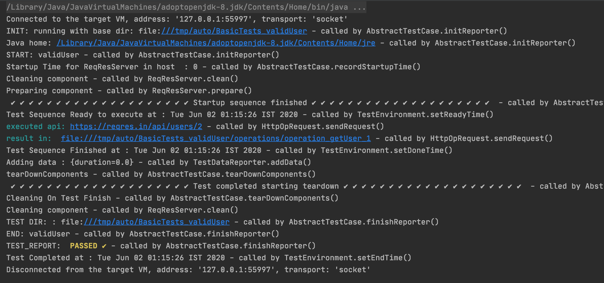

# Automation tool

## Team Endorsed
Special thanks to Sugam Agrwal, Vipul Popli, for contribution.

## Purpose
*To write automated tests for api, web ui and command line based application*

Below points may interesets you using this tool

* Embedded Mock server
* Easy to write tests
* Zero test case maintainability
* Clean teardown
* Advanced assertion api
* Advance rules
* Keep Logs of every action performed on server 
* Highly configurable reporting
* Easy deployable and ready to run regression
* Capable of stopping and starting components at every test run
* clean component 
* Abstraction of api , commandline and webApi operation to write tests faster
* usable utils (Json, Xml, File etc.)

### Need support using this tool in your org
Don't hesitate to write me a mail at (mrpjpandey@gmail.com with topic need Help) and I will help you for free.

## See it in action in a Sample App
While this guide explains the *what*, *why* and *how*, I find it helpful to see them in practice. This tool is accompanied by a sample application that follows basic usage . You can find the [sample application (named exampleApp) here](https://github.com/Priytam/auto/tree/master/exampleApp) in the `modular` folder. Feel free to grab it, clone it, or fork it. [Instructions on running it are in its readme](https://github.com/Priytam/auto/blob/master/exampleApp/readme.md).

## Contribution is always welcome
Create pull request against any bug or feature (raise one if doesnot exit). After reviewing it I will merge your PR and add your name in contributors list.

Add new feature docs in table of contents


## Table of Contents

  1. [Design](#design)
  1. [Getting Started](#getting-started)
  1. [Component](#component)
  1. [Test Case](#test-case)
  1. [Operations](#operations)
        * [Api Operations](#api-opration)
        * [Commandline Operations](#commandline-opration)
        * [WebUi Operations](#webui-opration)
  1. [Checks](#checks)
  1. [Configuration](#configuration)
  1. [Example test cases](#example-test-cases)
  1. [Reporting](#reporting)
  1. [Build and Deployment](#build-and-deployment)
  1. [Mock Server](#mock-server)
  1. [Annotations](#annotations)
  1. [Best Practices](#best-practices)
  1. [Modularity](#modularity)

## Design


Testing is divided into three verticals

* Components to be tests
* Operations to be performed on components
* Test Case which does above job and Assert its correctness

Components can be any application which uses any or all of Http api, Web Ui or Command Line 
to interact.

Operation is the request we made to component to perform some action. 

Test Case contain sets of Operation performed on component and one or more Assertion to check Its validity.

Above design decouple tests from operation and components and helps in zero test maintainability,
Lets say component was written in Node.js and now org decided to move it to java spring boot and hence its start stop
operation is different now what we need to change is stopOp and startOp of component and all hundreds and thousands of 
tests will remain intact and will continue to run like charm.

Suppose a travel product UI automated using this tool which have operation flight search and now UI template changed to material design
all automated tests written will keep on running after changing searchOp.   

One can say yes I can achieve this without any framework! My answer is yes you can. This framework helps you to achieve 
this in easy and clean way with high level of abstraction and advance apis. This framework follows best practices.
 
Auto has Generic Command Line, Http and Web action (using selenium) Op. It keeps the track of all operation performed in tests
helps in debugging. It has embedded mock server to mock third party api for tests stability.   

**[Back to top](#table-of-contents)**

## Getting Started

It is very easy to start using this tool, let me explain the same using some example. We will write test to automate https://reqres.in/
which have operations to
 * List users (https://reqres.in/api/users?page=2), 
 * Single User (https://reqres.in/api/users/2), 
 * Single User not found (https://reqres.in/api/users/23).


Create a gradle/maven project and include auto framework as dependency
```groovy
dependencies {
    compile 'com.github.priytam:framework:1.0'
}
```

```xml
<dependency>
  <groupId>com.github.priytam</groupId>
  <artifactId>framework</artifactId>
  <version>1.0</version>
</dependency>
```
Here we have one component to test (reqres) by performing above three operations. Since we can't start stop this component.

Component will be AlwaysRunningComponent
```java
    public class ReqResServer extends AbstractAlwaysRunningTestComponent {
    
        protected ReqResServer(TestComponentData dData) {
            super(dData);
        }
    
        @Override
        public void clean(boolean bForce) {
            // will be called during component tear down
        }
    
        @Override
        public void prepare() {
            // prepare component 
        }
    }
```

Creating our Test case
```java
    public class ReqResTestCase extends AbstractTestCase {
    
        private ReqResServer server;
    
        protected ReqResTestCase() {
            super("ReqRes");
        }
    
        @Override
        protected void initComponents() {
            TestComponentData testComponentData = new TestComponentData.Builder()
                    .build(getCurrentApplicationConfig().getServer());
            server = new ReqResServer(testComponentData);
        }
    
        @Override
        public List<? extends ITestComponent> getTestComponents() {
            TestReporter.TRACE("init example components");
            List<ITestComponent> lstComponents = new ArrayList<>();
            lstComponents.add(server);
            return lstComponents;
        }
        
        public ReqResServer getServer() {
            return server;
        }
    }
```

Creating GetUser Operation
```java
public class GetUserOp  extends AbstractHttpOperation {

    private final String baseUrl;
    private final int userId;
    private final static String USER_ENDPOINT = "/api/users/";

    public GetUserOp(String baseUrl, int userId) {
        this.baseUrl = baseUrl;
        this.userId = userId;
    }

    @Override
    protected HttpRequestBuilder getHttpRequestBuilder() {
        return new HttpRequestBuilder()
                .withBaseUrl(baseUrl + USER_ENDPOINT + userId)
                .withApiName("getUser")
                .withMimeType(MimeTypes.APPLICATION_JSON)
                .withRequestType(HttpMethods.GET);
    }

    @Override
    public boolean shouldRunInBackground() {
        return false;
    }

    @Override
    public String getName() {
        return "GetUserOp";
    }
}
```

Add getUser method in ReqResServer
```java
    public User getUser(int userId) {
        OpResult opResult = performOperation(new GetUserOp(getServer(), userId));
        if (CollectionUtils.isNotEmpty(opResult.getStdOut())) {
            return JsonUtil.deSerialize(opResult.toStringAsOneLine(), User.class);
        }
        return null;
    }
```

**Above work is one time now once can keep on writing tests for every feature of this component as below**

Test to check valid user for id 2 and invalid no user for id 23
```java
public class BasicTests extends ReqResTestCase {

   
    @Test
    public void validUser() {
        User user = getServer().getUser(2);
        Check.assertNotNull(user, "User not found");
        Check.assertNotNull(user.getData(), "User data was null");
        Check.assertEquals("janet.weaver@reqres.in", user.getData().getEmail(), "Incorrect email id");
        Check.assertEquals(2, user.getData().getId(), "Id was incorrect");
    }
    
    @Test
    public void invalidUser() {
        User user = getServer().getUser(23);
        Check.assertNull(user, "User found");
    }

    @Test
    public void adData() {
        User user = getServer().getUser(2);
        Check.assertNotNull(user.getAd(), "Ad was null");
        Check.assertNotNull(user.getAd().getCompany(), "Ad company was null");
        Check.assertEquals("StatusCode Weekly", user.getAd().getCompany(), "Incorrect company name");
    }
}
```
[See complete implementation here](https://github.com/Priytam/auto/tree/master/exampleApp/src/main/java/com/auto/example)

**Best part is test log**

Below is screenshot of test for above test validUser()


See the line **INIT: Running with base dir** the link after this is the directory where test logs will be saved (below is screenshot of that directory).


in above screenshot of base dir we can see all tests log is present in separate test directory(classname_methodname) and each 
has operations dir with all operations' request, response and status performed in test case in separate files (operation_<name>_seqno).

The current directory is softlink to most recent test ran, helps to identify directory of test we are wroking on.

In log screenshot see the line **result in file** this log indicates the get user operation ran in test with link to file 
location, this becomes handy while automating test cases we can click on file and see what went wrong... wow.

Let's see the content of file (content is obvious no need to explain).


**[Back to top](#table-of-contents)**

## Component

  ```java
  public class test() {
  }
  ```
**[Back to top](#table-of-contents)**

## Test Case

  ```java
  public class test() {
  }
  ```
**[Back to top](#table-of-contents)**

## Operations

  ```java
  public class test() {
  }
  ```
**[Back to top](#table-of-contents)**


## Operations

  ```java
  public class test() {
  }
  ```
**[Back to top](#table-of-contents)**


## Checks

  ```java
  public class test() {
  }
  ```
**[Back to top](#table-of-contents)**


## Configuration

  ```java
  public class test() {
  }
  ```
**[Back to top](#table-of-contents)**

## Example test cases

  ```java
  public class test() {
  }
  ```
**[Back to top](#table-of-contents)**

## Reporting

  ```java
  public class test() {
  }
  ```
**[Back to top](#table-of-contentss)**

## Build and Deployment

  ```java
  public class test() {
  }
  ```
**[Back to top](#table-of-contents)**

## Mock-Server

  ```java
  public class test() {
  }
  ```
**[Back to top](#table-of-contents)**

## Annotations

  ```java
  public class test() {
  }
  ```
**[Back to top](#table-of-contents)**

## Best Practices

  ```java
  public class test() {
  }
  ```
**[Back to top](#table-of-contents)**

## Modularity

  ```java
  public class test() {
  }
  ```
**[Back to top](#table-of-contents)**
